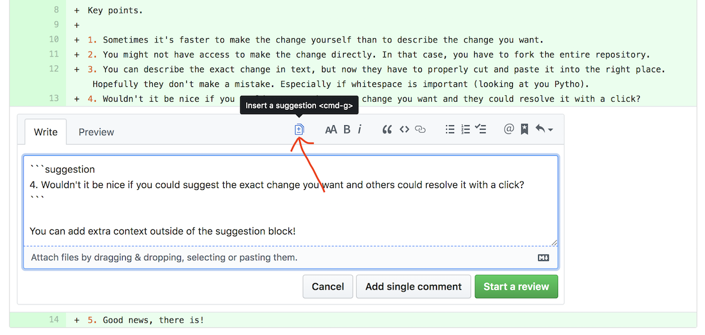

# Advanced Git

## Pull Request Reviews

It is a best practice to have at least one other person review all pull requests when code is pushed into a repository. This ensures that we are following [Linus's Law](https://en.wikipedia.org/wiki/Linus%27s_law) which states "given enough eyeballs, all bugs are shallow".

The process to review code is nearly the same with all git services, since we are using github for this training we will show how to do it here.

1. Click the Pull Request tab, then from the Pull Request page, choose the pull request you would like to review.

   Example:

   

2. Click `Files Changed` in the center (1 in example below), and then `AFTER` you have reviewed all of the files click `Review Changes` on the right (2 in example below).

   Example:

   

3. If there is something you would like to change you can add a comment for changes to the person making the pull request by clicking the plus next to the code you want to change.

   Example:

   

4. Even better than just commenting you can also suggest a change so they can just click yes and it will make the change for them by highlighting the code you want to change and clicking the insert suggestion button.

   Example:

   

## Git pull

If you are collaborating on code you will need to make sure you have the latest version of the code in your local repository to avoid conflicts. this is done via `git pull`. Below is an example of what was just done before starting work on this part of the exercise. Since we had pushed code in, and merged it to main the local copy was different than the remote copy for the main branch.

```shell
git checkout main
```

Output (git is nice enough to recommend hot to fix the issue):

```shell
Switched to branch 'main'
Your branch is behind 'origin/main' by 23 commits, and can be fast-forwarded.
  (use "git pull" to update your local branch)
```

Since the code is different we need to execute `git pull` to pull the remote changes to our local system.

```shell
git pull
```

Output:

```shell
Updating 99f77f0..1908194
Fast-forward
 README.md                                       |  28 ++++++++--------
 _config.yml                                     |   3 ++
 workshops/git_101/01-init.md                    | 102 ++++++++++++++++++++++++++++++++++++++++++++++++++++++++
 workshops/git_101/02-clone-commit-push-merge.md | 164 ++++++++++++++++++++++++++++++++++++++++++++++++++++++++++++++++++++++++++++++++++++++++++
 workshops/how_we_enable/01-Getting_Started.md   |  21 ++++++++++--
 workshops/how_we_enable/02-Logistics.md         |   4 +++
 6 files changed, 305 insertions(+), 17 deletions(-)
 create mode 100644 _config.yml
 create mode 100644 workshops/git_101/01-init.md
 create mode 100644 workshops/git_101/02-clone-commit-push-merge.md
 ```

## Rebase

## Git Diff and Stash

Git diff is a way to see what is different between two branches.

Atlasian has a great tutorials on [diff](https://www.atlassian.com/git/tutorials/saving-changes/git-diff) and [stash.](https://www.atlassian.com/git/tutorials/saving-changes/git-stash) Please go through each of these as they are great walk throughs.

## Branching Strategies

There are many different strategies for branching code, however the feature branch strategy has become the standard in Open Source this is also referred to as [Github Flow](https://guides.github.com/introduction/flow/).

For in depth information on all strategies Martin Fowler has a great blog on it [here.](https://martinfowler.com/articles/branching-patterns.html)

---

[Merge Conflicts](04-merge-conflicts.md)